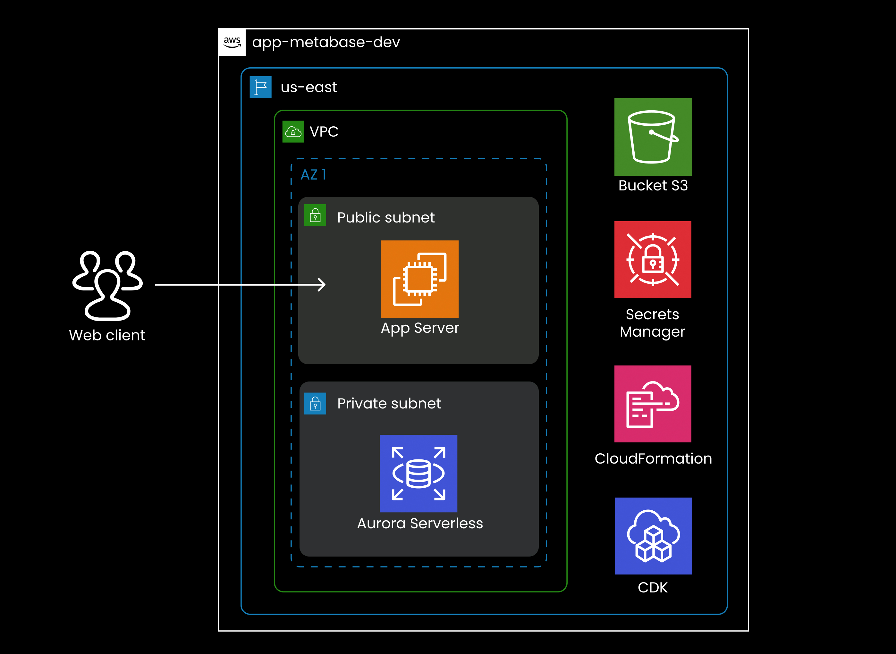

# Metabase on AWS CDK

This project provides a low-cost solution to deploy Metabase Open Source on AWS using the Cloud Development Kit (CDK) with TypeScript. It is designed to be scalable, cost-effective, and easy to manage, leveraging AWS services like Aurora Serverless and Spot Instances.

## Architecture

The infrastructure consists of:

- **Compute Layer**: Single EC2 t4g.micro Instance running Metabase
- **Database Layer**: Aurora Serverless v2 PostgreSQL
- **Networking**: VPC with public and private subnets in 2 AZs

## Prerequisites

- **AWS CLI** configured with appropriate permissions.
- **Node.js** version >= 14.x installed.
- **AWS CDK CLI** installed globally (`npm install -g aws-cdk`).
- An existing SSH key pair in your AWS account named `diego-mac-keys` (or modify the key name in `compute-stack.ts`).

## Stack Components

1. **NetworkingStack**: VPC and network infrastructure
2. **DataStack**: Aurora Serverless PostgreSQL database
3. **ComputeStack**: EC2 Spot instance with Metabase

## Deployment

## Future Improvements
- Add a load balancer for high availability.
- Add an autoscaling group for EC2.
- Integrate with S3 for storing Metabase data backups.